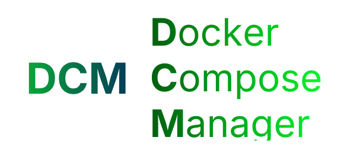
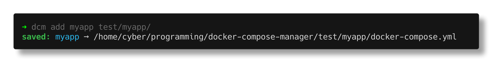
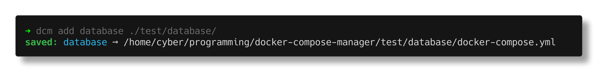
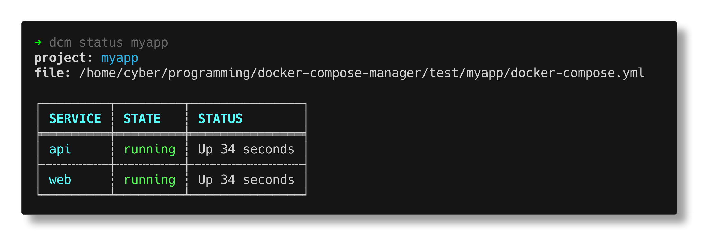
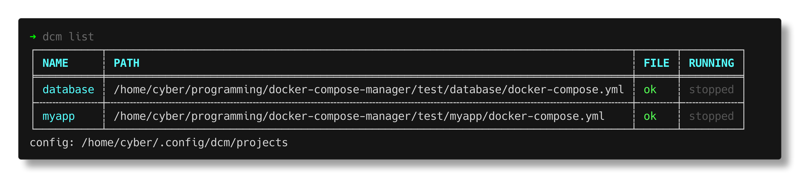
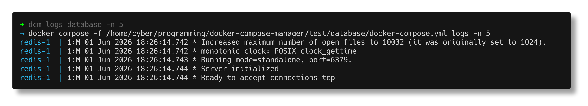

# dcm — Docker Compose Manager



> This tool was largely generated with the help of LLMs.

Tired of `cd`-ing to the right directory just to run `docker compose up`? `dcm` lets you save your compose projects under short names and manage them from anywhere.

## Install

```sh
cargo install --git https://github.com/Cyber3x/docker-compose-manager
```

## Usage

**Save a project**

```sh
dcm add myapp /path/to/myapp          # explicit path
dcm add myapp .                       # current directory
```




**Start / stop**

```sh
dcm up myapp
dcm up myapp -d                       # extra flags pass through
dcm down myapp
```


**Check status**

```sh
dcm status myapp                      # per-service table
dcm list                              # all projects + running state
```




**Follow logs**

```sh
dcm logs myapp                        # all services
dcm logs myapp web                    # specific service
```



**Run any compose subcommand**

```sh
dcm run myapp exec web sh
dcm run myapp ps
```

**Manage saved projects**

```sh
dcm rename myapp myapp-v2             # rename (alias: mv)
dcm rm myapp                          # remove
```

**Shell completions**

```sh
eval "$(dcm completions bash)"        # bash
eval "$(dcm completions zsh)"         # zsh
dcm completions fish | source         # fish
```

## Config

Projects are stored in `$XDG_CONFIG_HOME/dcm/projects` (default: `~/.config/dcm/projects`).

To use a custom location — useful for syncing across machines via Dropbox or Syncthing — set `DCM_DB`:

```sh
export DCM_DB=~/Dropbox/dcm-projects
```

Priority order: `DCM_DB` → `$XDG_CONFIG_HOME/dcm/projects` → `~/.config/dcm/projects`.

## License

MIT
